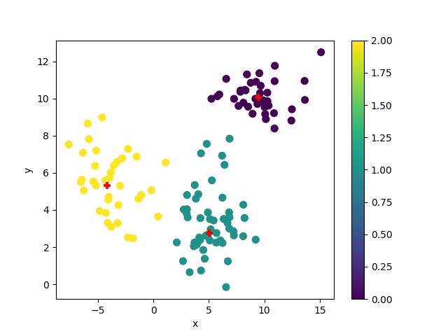
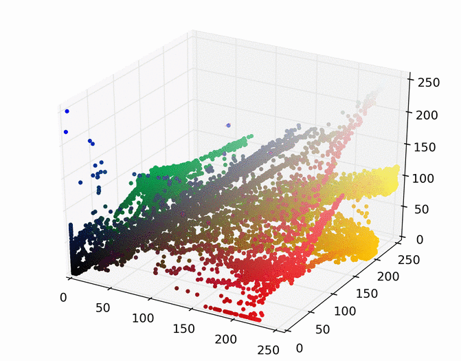
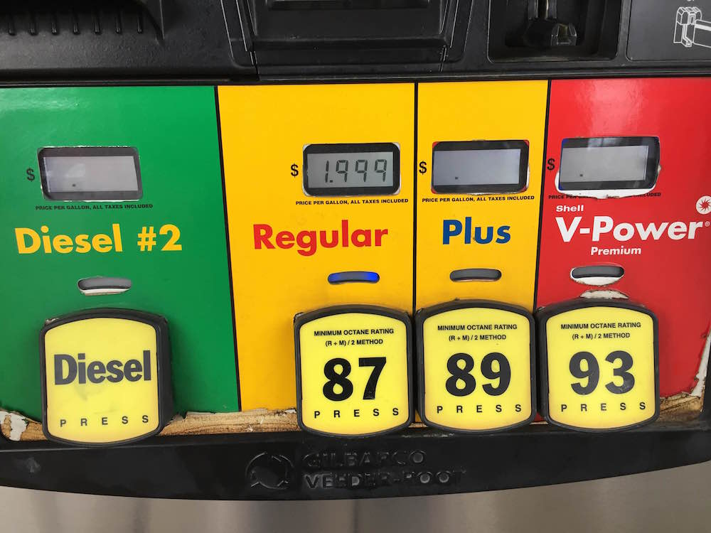
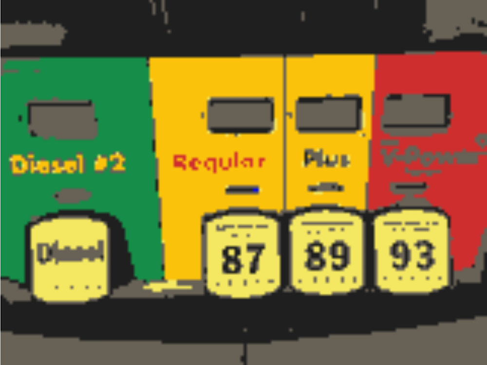

## Mean Shift Clustering

#### Image Segmentation
Mean shift can be used for image segmentation. Below is an example of an image being mean shift clustered in 3D RGB space, resulting in 7 clusters.

<table border="0">
<tr>
<td></td>
<td></td>
</tr>
</table>

